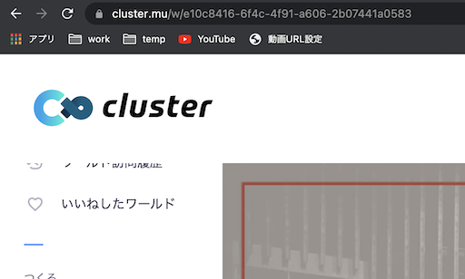

# WorldAccessNotification

cluster のワールドに配布アイテムを設置する事で、 Discord に 入室通知が届くBOT を利用する事ができるようになります。

# 配布物
- [WorldAccessNotification Discord BOT](https://discord.com/api/oauth2/authorize?client_id=863341003880923156&permissions=67584&scope=bot)
- [WAN.unitypackage](unity/WAN.unitypackage) Unityパッケージ

# BOTの追加 方法
下のURLにアクセスすると Discord の チャンネルにBOT を招待する事ができます。

[WorldAccessNotification BOT を 追加する](https://discord.com/api/oauth2/authorize?client_id=863341003880923156&permissions=67584&scope=bot)

# 通知ツール使い方

BOT追加した後に いつくかコマンドで設定する必用があります。 設定は BOTを招待した チャンネルで行います。

## ワールドID の 見つけ方
cluster に ワールドをアップロードすると URLが決定されます。 



例えばこのワールドの場合 `https://cluster.mu/w/` 以降が ワールドID です。  
この ワールドID が 各コマンド で利用するIDとなります。 

https://cluster.mu/w/e10c8416-6f4c-4f91-a606-2b07441a0583  
https://cluster.mu/w/[ワールドID]

## !set コマンド
通知を受け取るために必用な設定です。 ワールドURL を指定した場合は 自動で ワールドID と タイトルが設定されます。

```
!set [ワールドID] [ワールド名]
または
!set [ワールドのURL] 
```

## !pv コマンド
訪問者数 を 教えてもらえます。 

```
!pv [ワールドID]
```

# Unity アイテムへの設定方法

1. WAN Unityパッケージを [ココから WAN.unitypackage](unity/WAN.unitypackage) ダウンロードする
2. 設置したいワールドのUnityプロジェクトをひらいた状態で WAN.unitypackage をダブルクリックしてインポートする
3. Assets -> t_furu -> WorldAccessNotification を開くと WAN Prefab がある
4. シーンのルートに WAN Prefab を配置する
5. 配置した WAN を `Unpack Prefab` する
6. VideoPlayer の Source URL に したのURLを設定する  
   `https://us-central1-worldaccessnotification.cloudfunctions.net/api/access/[ワールドID]`
7. ワールドに入室してみて Discord BOT に通知が来るか確認する

# デモ設置先 Discord

[WorldAccessNotification](https://discord.gg/RqPfKymS)  

コマンドを自由に試す事ができます。

# 質問 や 不明点があれば

Twitter [@t_furu](https://twitter.com/t_furu) 宛にメッセージください。  
DM よりツイートの方が 反応いいです。
